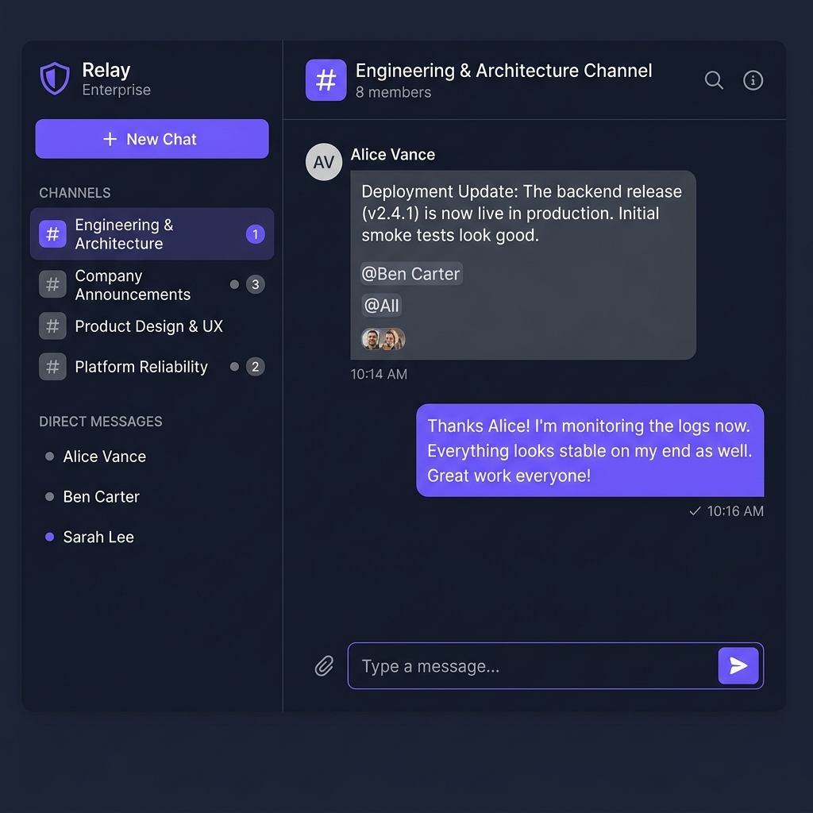
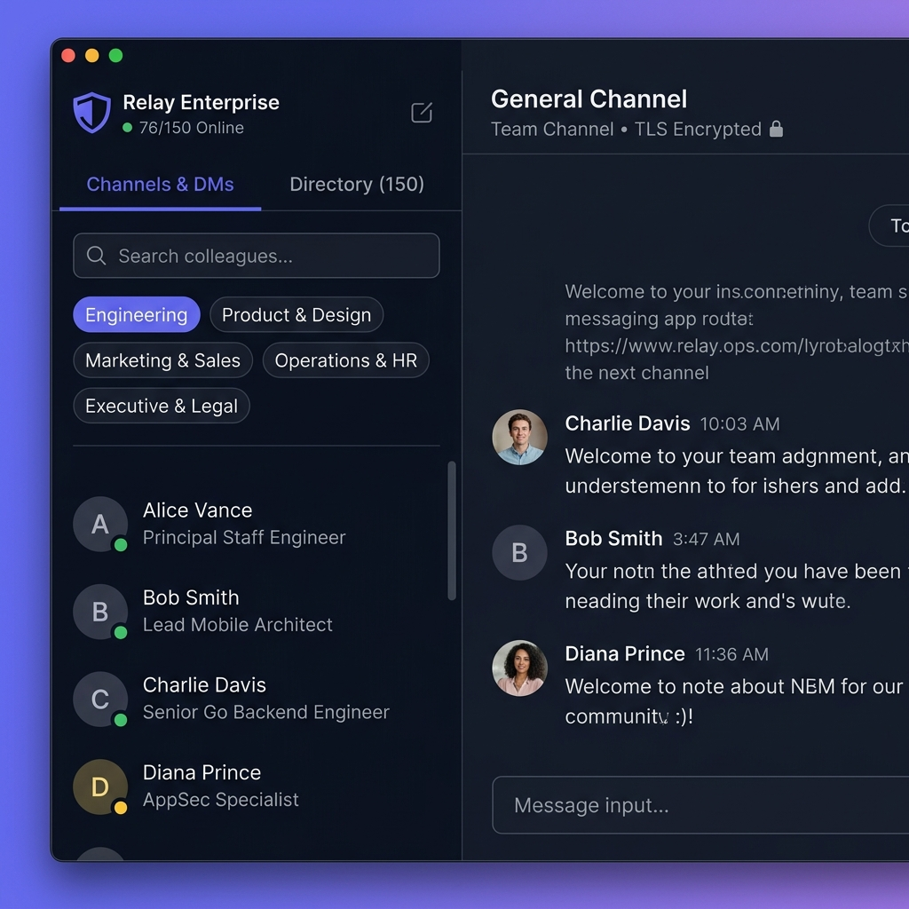
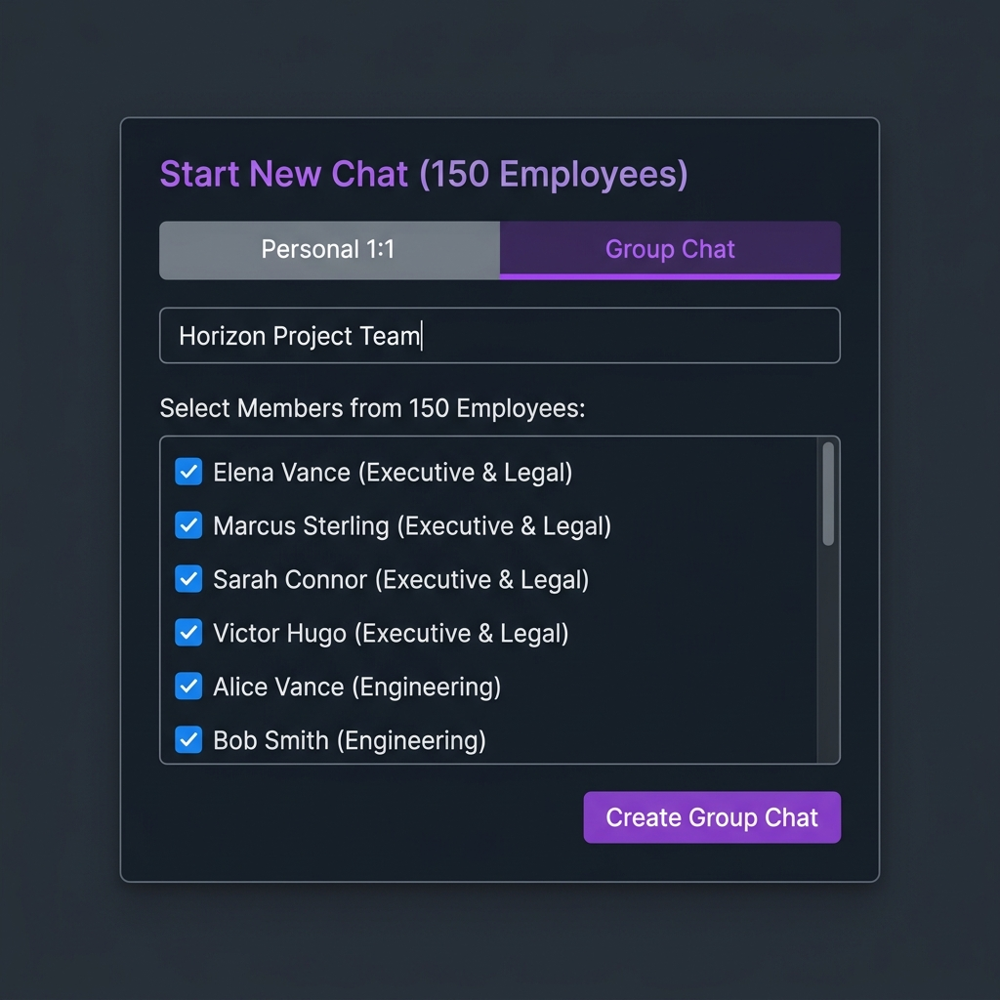

# Relay Enterprise

A high-performance, self-hosted, company-internal messaging platform built for organizations of 150+ employees. Supports 1:1 direct messaging, group channels, offline-first client synchronization, file attachments with virus scanning, real-time presence, and OIDC Single Sign-On.

## Screenshots

### Chat Interface — Channels & Direct Messages


### 150-Employee Company Directory with Department Filters


### Group Chat Creation — Multi-Select from Full Organization


## Features

### Messaging
- **Personal 1:1 Direct Chats** — Idempotent conversation creation prevents duplicate channels between team members
- **Group Channels** — Create departmental or project-based channels with custom names
- **Real-Time WebSocket Delivery** — Messages appear instantly across all connected clients
- **Offline-First Architecture** — Messages queue locally via outbox state machine and sync when connectivity restores
- **File Attachments** — Presigned S3 uploads with ClamAV virus scanning before delivery

### Enterprise Directory (150+ Employees)
- **Full Company Directory** — Browse all employees with name, title, and online status
- **Department Filtering** — Filter by Engineering, Product & Design, Marketing & Sales, Operations & HR, Executive & Legal
- **Instant Search** — PostgreSQL trigram index-backed fuzzy search by name, email, or job title
- **Presence Tracking** — Real-time online/away/offline status indicators

### Security
- **TLS Encrypted** — End-to-end transport encryption via Caddy reverse proxy
- **WebSocket Origin Validation** — Anti-CSWSH protection with strict origin pattern matching
- **Non-Wildcard CORS** — Explicit allowed origins with credentials support
- **Rate Limiting** — Sliding-window token-bucket protection (10 req/min auth, 30 req/min search)
- **Production Dev Guard** — Dev-auth endpoints automatically blocked in production mode
- **RBAC Group Governance** — Owner/Admin/Member role enforcement for group management
- **JWT Secret Validation** — Minimum key length enforcement at startup

## Tech Stack

| Layer | Technology |
|:---|:---|
| **Backend** | Go 1.22+ (Hexagonal Architecture, Chi Router, nhooyr.io/websocket, pgx/v5, sqlc) |
| **Database** | PostgreSQL 16 (Trigram indexing, composite indexes) |
| **Cache & Pub/Sub** | Redis 7 |
| **Object Storage** | MinIO (S3 compatible, presigned uploads) |
| **Virus Scanning** | ClamAV |
| **Reverse Proxy / TLS** | Caddy 2 |
| **Web Client** | Next.js 14 (App Router, TypeScript) |
| **Mobile Client** | React Native / Expo (iOS & Android, TypeScript) |
| **Shared SDK** | `@company-chat/shared` (API client, sync engine, outbox state machine, IndexedDB storage) |

## Monorepo Layout

```
relay-in-house-messaging-app/
├── apps/
│   ├── web/                 # Next.js web application
│   ├── mobile/              # React Native / Expo mobile app
│   └── server/              # Go backend service
│       ├── cmd/server/      # Entry point
│       └── internal/
│           ├── auth/        # JWT manager & middleware
│           ├── config/      # Environment configuration
│           ├── domain/      # Domain models
│           ├── repository/  # PostgreSQL data access
│           ├── service/     # Business logic (chat, search, RBAC)
│           └── transport/
│               └── http/    # HTTP handlers, WebSocket, rate limiting
├── packages/
│   └── shared/              # Shared TypeScript types, API client, sync engine
├── infra/
│   ├── docker-compose.yml   # Full local infrastructure stack
│   ├── Caddyfile            # Caddy reverse proxy configuration
│   └── migrations/          # SQL database migrations
├── docs/
│   └── screenshots/         # Application screenshots
└── README.md
```

## Quick Start

### Prerequisites

- Node.js 18+ and pnpm
- Go 1.22+
- Docker and Docker Compose

### 1. Clone and Configure

```bash
git clone <repo-url> relay-in-house-messaging-app
cd relay-in-house-messaging-app
cp .env.example .env
```

### 2. Start Infrastructure

```bash
cd infra && docker compose up -d
```

This starts PostgreSQL, Redis, MinIO, ClamAV, and Caddy.

### 3. Run the Backend

**Via Docker (recommended):**
```bash
cd infra && docker compose up -d --build server
```

**Via local Go:**
```bash
export $(cat .env | xargs) && cd apps/server && go run ./cmd/server
```

### 4. Run the Web App

```bash
pnpm install
pnpm dev:web
```

Open [http://localhost:3000](http://localhost:3000) in your browser.

### 5. Run the Mobile App

```bash
pnpm dev:mobile
```

Scan the QR code with Expo Go on your device.

## Infrastructure Services

| Container | Service | Port |
|:---|:---|:---|
| `infra-server-1` | Go Backend | `8080` |
| `infra-postgres-1` | PostgreSQL 16 | `5432` |
| `infra-redis-1` | Redis 7 | `6379` |
| `infra-minio-1` | MinIO S3 | `9000`, `9001` (console) |
| `infra-clamav-1` | ClamAV Scanner | internal |
| `infra-caddy-1` | Caddy Proxy | `80`, `443` |

## Command Reference

| Command | Description |
|:---|:---|
| `pnpm dev:web` | Start Next.js web app in development mode |
| `pnpm dev:mobile` | Start Expo mobile app |
| `cd infra && docker compose up -d` | Start all infrastructure services |
| `cd infra && docker compose up -d --build server` | Rebuild and start Go backend |
| `cd infra && docker compose logs -f server` | Stream backend logs |
| `cd infra && docker compose down` | Stop all services |
| `pnpm --filter @company-chat/shared build` | Rebuild shared SDK package |

## Database Migrations

Migrations are in `infra/migrations/` and run automatically on server startup:

- `0001_initial_schema.sql` — Core tables (users, conversations, members, messages, attachments)
- `0002_user_search_and_group_roles.sql` — Trigram search indexes and RBAC role columns

## Production Deployment Notes

- Set `ENVIRONMENT=production` to activate the production dev-login guard
- Configure `ALLOWED_CORS_ORIGINS` and `ALLOWED_WS_ORIGINS` with your actual domain
- Ensure `JWT_SECRET` is at least 32 bytes
- Mount Docker volumes on LUKS-encrypted partitions for at-rest data compliance

## License

Proprietary — Internal use only.
